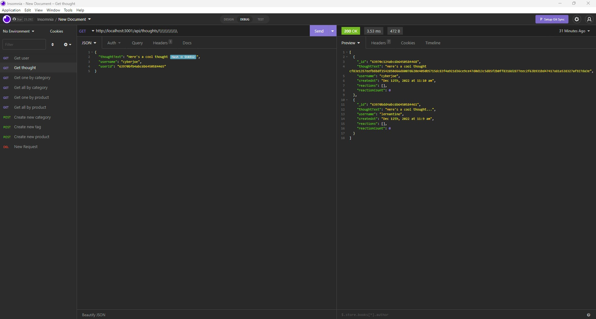

# Social Network API
## To show how a social network may work
### Table of Contents
- [Project Discription](#Discription)
- [Useage](#Useage)
- [Installation](#Installation)
- [Contributions](#Constributions)
- [Licence](#Licence)
- [Email](#Questions)
- [github](#Questions)

## Discription
This program when launched creates a server which the user can interact with via insomnia.

## Useage 
This program is intended to be used as a proof of concept for database construction and how a social network would work using nosql as a frame work.

## Installation
To use the server the user must us npm install to install the dependencies then the user can use npm start to start the app.

## Contributions 
I am the main contributor.

## Licence 

## Questions 
For any further questions that are not addressed in  this README please find my email and github below

### email: jbbalshaw@gmail.com
### github: 

## ScreenShots

## video

https://youtu.be/k7oM69RnfRw
